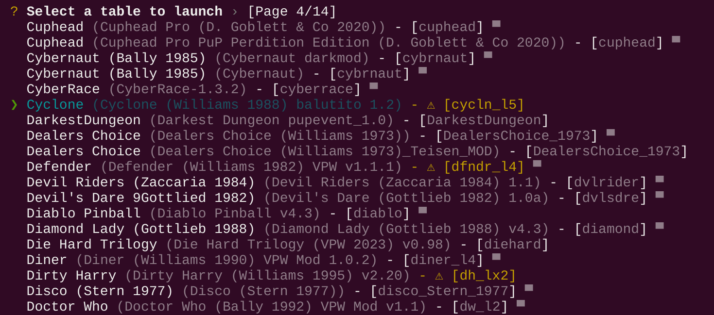

# vpxtool

Cross-platform utility for the vpinball ecosystem

Join [#vpxtool on "Virtual Pinball Chat" discord](https://discord.gg/eYsvyMu8) for support and questions.

## Install

Download the latest release for your operating system at https://github.com/francisdb/vpxtool/releases, extract it and
if wanted copy or symlink the binary to `$HOME/bin` to put in on your path

### macOS

After extracting the archive you will have to remove the quarantine flag through
`System Settings / Privacy & Security / Allow Anyway button` or on the command line as shown below.

```
xattr -d com.apple.quarantine vpxtool
```

### Using cargo

If you have [cargo](https://doc.rust-lang.org/cargo/getting-started/installation.html) installed you can install
vpxtool with the following command:

```
cargo install vpxtool
```

## Usage

### Command Line Interface (CLI)

Show help

```shell
> vpxtool --help
```

```
Vpxtool v0.16.0

Extracts and assembles vpx files

Usage: vpxtool [COMMAND]

Commands:
  info            Vpx table info related commands
  diff            Prints out a diff between the vbs in the vpx and the sidecar vbs
  frontend        Text based frontend for launching vpx files
  simplefrontend  Simple text based frontend for launching vpx files
  index           Indexes a directory of vpx files
  script          Vpx script code related commands
  ls              Show a vpx file content
  extract         Extracts a vpx file
  extractvbs      Extracts the vbs from a vpx file next to it
  importvbs       Imports the vbs next to it into a vpx file
  verify          Verify the structure of a vpx file
  assemble        Assembles a vpx file
  patch           Applies a VPURemix System patch to a table
  new             Creates a minimal empty new vpx file
  config          Vpxtool related config file
  images          Vpx image related commands
  gamedata        Vpx gamedata related commands
  romname         Prints the PinMAME ROM name from a vpx file
  help            Print this message or the help of the given subcommand(s)

Options:
  -h, --help     Print help
  -V, --version  Print version
```

Show help for a specific command

```shell
> vpxtool frontend --help`
Acts as a frontend for launching vpx files

Usage: vpxtool frontend [OPTIONS] [VPXROOTPATH]

Arguments:
  [VPXROOTPATH]  The path to the root directory of vpx files [default: /Users/myuser/vpinball/tables]

Options:
  -r, --recursive  Recursively index subdirectories
  -h, --help       Print help
```

#### Text UI Frontend

Vpxtool can act as a frontend for launching vpx files. It will index a directory of vpx files and then present a menu to
launch them.

```
> vpxtool frontend
```



## Configuration

A configuration file will be written to store among others the Visual Pinball executable location. The config file is
using the [TOML](https://toml.io) format.

When launching the frontend for the first time, it will help you to set up the required settings.

To show the current config location, use the following command

```
vpxtool config path
```

To edit the config file using your system default editor, do the following

```
vpxtool config edit
```

### Configuring vpinball paths

```yaml
vpx_executable = "/home/myuser/vpinball/VPinballX_BGFX"

  # Optional settings below, only needed if the defaults don't work
tables_folder = "/home/myuser/vpinball/tables"
vpx_config = "/home/myuser/.vpinball/VPinballX.ini"
```

Further settings will be picked up from the Visual Pinball config.

### Configuring a custom editor

When actions are invoked that open an editor, the default editor configured for your system will be used. In case you
want to override this with a specific editor, you can add the following line to the config file:

```yaml
# use Visual Studio Code as default editor
editor = "code"
```

## Projects using vpxtool

* https://github.com/syd711/vpin-studio
* https://github.com/jsm174/docker-vpxtool-resize
* https://github.com/mpcarr/aztec-quest
* https://github.com/francisdb/vpinball-example-table-extracted
* https://github.com/surtarso/vpx-gui-tools

## References / Research

Other related projects that read and/or assemble vpx files:

* https://github.com/vpinball/vpinball
* https://github.com/vpdb/vpx-js
* https://github.com/freezy/VisualPinball.Engine
* https://github.com/stojy/ClrVpin
* https://github.com/vbousquet/vpx_lightmapper

An example vpx managed in github with some imagemagick scripts to compose textures

https://github.com/vbousquet/flexdmd/tree/master/FlexDemo

## Building

The project uses the default [rust](https://www.rust-lang.org/) build tool `cargo`. To get going read the docs on
installation and first steps at https://doc.rust-lang.org/cargo/

In case you are running Linux, the graphical frontend requires some extra operating system dependencies. These are
listed in the [bevy linux dependencies](https://github.com/bevyengine/bevy/blob/main/docs/linux_dependencies.md)
document.

```
cargo build --release
```
